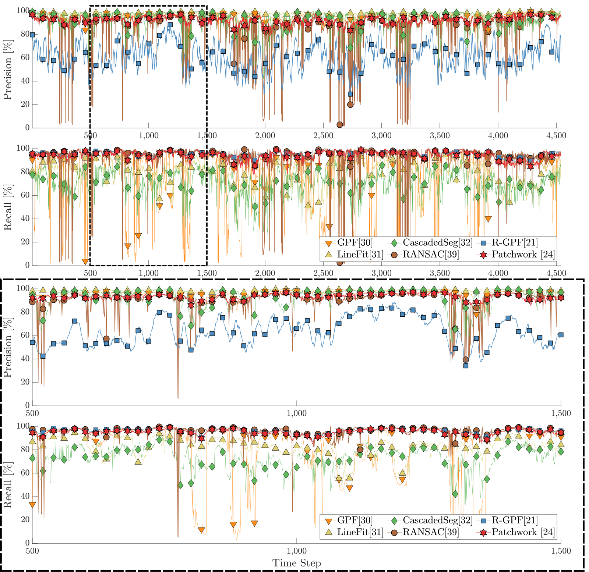

# Ground Segmentation Benchmark 

All the baseline methods are organized.

## Contributor

* jeewon Kim (as a research intern @ [URL](https://urobot.kaist.ac.kr/)): `ddarong2000@kaist.ac.kr`
* Hyungtae Lim: `shapelim@kaist.ac.kr`

## Requirements

* unavlib
* jsk_visualization (For visualization of GLE of Patchwork)
 
```
sudo apt-get install ros-melodic-jsk-recognition
sudo apt-get install ros-melodic-jsk-common-msgs
sudo apt-get install ros-melodic-jsk-rviz-plugins
```

## How to use

`launch` 폴더 내의 파일들 참조

* 각 .sh 파일로 sequence를 전체 다 저장하는 코드가 있음
* "'00'"이 그냥 bash shell에서는 숫자로 들어가는데, zsh에서만 현재 사용 가능

```asm
$ cd ${path of nonplnar_gpf}/launch
$ zsh autosave_gpf.sh
```

## Parameters of Benchmark

```
rosparam set /data_path "/data/SemanticKITTI/sequences"
rosparam set /output_csvpath "/data/patchwork22/"
rosparam set /stop_for_each_frame true
rosparam set /save_csv_file true
rosparam set /init_idx 0
```

아래의 알고리즘들이 구현되어 있음

* CascadedSeg
* GPF
* LineFit
* Patchwork (ver.1)  
* R-GPF
* Mono plane estimation by RANSAC




**RVIZ**는 `ground4_r_gpf.rviz` 사용하면 됨!

#### Point label 관련
* point의 member 변수들은 `utils/common.hpp`에 나와있음: `x, y, z, intensity, label, id`로 구분됨. 여기서 id는 각 object의 아이디임 (본 레포에서는 안 쓰일듯)
* label은 int로 돼있는데, 각 int가 나타내는 건 [SemanticKITTI API](https://github.com/PRBonn/semantic-kitti-api/blob/master/config/semantic-kitti.yaml)에 나와있음
* Patchwork에서는 vegetation도 아랫 부분은 ground라고 간주하고 뽑았으나, Patchwork++에서는 그렇지 않음

--- 

#### 진행 사항

* **msg의 node.msg는 절대 변경하지 마셈!** 변경하면 bag 파일의 node를 callback 못 받음...bag 파일을 재생성해야 callback을 받을 수 있음
* 사용하기 용이한 flags들 설정 (변수로?)
* launch 파일 간소화하기
* 해당 알고리즘에 대한 rviz 파일을 따로 생성하길 권장


