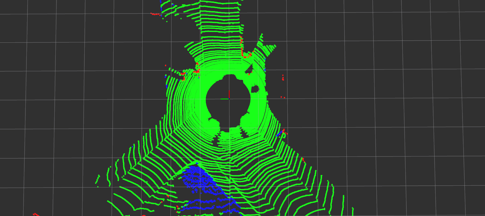
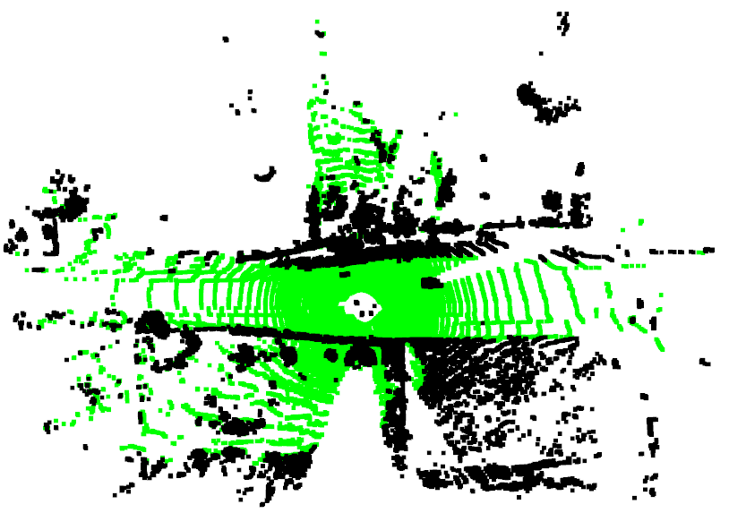

# Ground Segmentation Benchmark

This repository contains various Ground Segmentation baseline methods. Currently, 7 projects are organized for *SemanticKITTI dataset*:

* [GPF](https://github.com/VincentCheungM/Run_based_segmentation) (Ground Plane Fitting)
* [CascadedSeg](https://github.com/n-patiphon/cascaded_ground_seg)
* [R-GPF](https://github.com/LimHyungTae/ERASOR) (Region-wise GPF)
* [LineFit](https://github.com/lorenwel/linefit_ground_segmentation)
* [Mono plane estimation by RANSAC](https://github.com/jafrado/qhulltest)
* [Patchwork](https://github.com/LimHyungTae/patchwork) (ver.1)
* [Gaussian Floor Segmentation](https://github.com/SmallMunich/FloorSegmentation/tree/master/Gaussian_process_based_Real-time_Ground_Segmentation_for_Autonomous_Land_Vehicles)

## Citation

If our open sources have been helpful, please cite the below papers published by our research group:
```
@inproceedings{oh2022travel,
    title={{TRAVEL: Traversable ground and above-ground object segmentation using graph representation of 3D LiDAR scans}},
    author={Oh, Minho and Euigon, Jung and Lim, Hyungtae and Song, Wonho and Hu, Sumin and Lee, Eungchang Mason and Park, Junghee and Kim, Jaekyung and Lee, Jangwoo and Myung, Hyun},
    booktitle={IEEE Robotics and Automation Letters},
    year={2022},
    note={{Submitted}}
}
```

```
@inproceedings{lee2022patchworkpp,
    title={{Patchwork++: Fast and robust ground segmentation solving partial under-segmentation using 3D point cloud}},
    author={Lee, Seungjae and Lim, Hyungtae and Myung, Hyun},
    booktitle={Proc. IEEE/RSJ Int. Conf. Intell. Robots Syst.},
    year={2022},
    note={{Submitted}} 
}
```

```
@article{lim2021patchwork,
    title={Patchwork: Concentric Zone-based Region-wise Ground Segmentation with Ground Likelihood Estimation Using a 3D LiDAR Sensor},
    author={Lim, Hyungtae and Minho, Oh and Myung, Hyun},
    journal={IEEE Robot. Autom. Lett.},
    volume={6},
    number={4},
    pages={6458--6465},
    year={2021},
    }
```

## Contents

0. [Description](#Description)
1. [Requirements](#Requirements)
2. [Preparing DataSet](#Preparing-DataSet)
3. [Getting Started](#Getting-Started)
4. [Python visualization / Provided result files](#If-you-are-not-familiar-with-ROS/C++...)


## Description
This benchmark provides:
### Performance Calculation
* The benchmark calculates the performance of each method and save the results as *csv* files.
* The output files contain `frame index - time taken - Precision - Recall - TP - FP - FN - TF` values.
* Two versions are to be saved: considering vegetation / not considering vegetation.


### RVIZ
* It visualizes the ground segmentation result on RVIZ.
  
  * green: *True Positive*
  * blue: *False Negative*
  * red: *False Positive*


## Requirements

### Test Environment
The code wass tested successfully at
* Linux 18.04 LTS
* ROS Melodic
* Ptyhon 3.6.9

### Settings

* Install [ROS](http://wiki.ros.org/melodic/Installation) on a machine
* Install [jsk_visualization](https://github.com/jsk-ros-pkg/jsk_visualization) (For visualization of GLE of Patchwork)

```
sudo apt update
sudo apt-get install ros-melodic-jsk-recognition
sudo apt-get install ros-melodic-jsk-common-msgs
sudo apt-get install ros-melodic-jsk-rviz-plugins
```
* Install [PCL](https://pointclouds.org/downloads/)
```
sudo apt-get install libpcl-dev
```

### Install Package
* Clone our package with [catkin tools](https://catkin-tools.readthedocs.io/en/latest/)
```asm
$ cd ~/catkin_ws/src
$ git clone git@github.com:url-kaist/Ground-Segmentation-Benchmark.git
$ catkin build gseg_benchmark
```

## Preparing Dataset

### Offline KITTI dataset
1. Download [SemanticKITTI](http://www.semantic-kitti.org/dataset.html#download) Odometry dataset including Velodyne point clouds, calibration data, and label data.
2. Set `data_path` parameter in [shellscripts/common.sh](#Set-Parameters-ofBenchmark) for your machine.

The `data_path` consists of `velodyne` folder and `labels` folder as follows:
```
${data_path}
    |___00
        |___labels
        |    |___000000.label
        |    |___000001.label
        |    |___ ...
        |___velodyne
            |___000000.bin
            |___000001.bin
            |___ ...
    |___01
        |___labels
        |    |___ ...
        |___velodyne
            |___ ...
```

## Getting Started

### Set Parameters of Benchmark
* Set parameters about dataset path, running method, saving csv output files in `shellscripts/common.sh`.
* Make directories to load [SemanticKITTI](#Offline-KITTI-dataset) dataset and save output files and apply them in rosparam setting.

```
rosparam set /data_path "/home/user/data/SemanticKITTI/"  # absolute path of downloaded KITTI dataset. It must include '/' at the end part
rosparam set /stop_for_each_frame false                   # set as 'true' to make it stop every frame 
rosparam set /init_idx 0                                  # index of first frame to run
rosparam set /save_csv_file true                          # set as 'false' if csv output files are not needed
rosparam set /save_pcd_flag false                         # set as 'false' if csv output files are not needed
rosparam set /output_path "/data/"                        # reltive path of output files to be generated
```

### Run Ground Segmentation Algorithms

* Start roscore:
```asm
$ roscore
``` 
* Open a new terminal and launch node with specification of algorithm and data sequence:
```asm
$ roslaunch gseg_benchmark gseg_benchmark.launch alg:=${name of algorithm} seq:=${sequence}
```
For example,
```asm
$ roslaunch gseg_benchmark gseg_benchmark.launch alg:=patchwork seq:=05
```

* There are 7 algorithms provided: `gpf`, `cascaded_gseg`, `r_gpf`, `linefit`, `ransac`, `patchwork`, `gaussian`
* The examples of `seq` are 00, 01, ..., 10
  * If you do not set `seq` or set as `seq:=all`, then the csv output files of all datasets from "00" to "10" will be saved automatically.
* Rviz result will be shown automatically.

## If you are not familiar with ROS/C++...

### Provided Result Files
We provide csv files of binary estimated results of sequences from "00" to "10". [download](https://drive.google.com/drive/folders/1WgjBiv6oCpJW65ECkHcMEhQdnTva7qlj?usp=sharing) \
1 for ground points, 0 for non-ground points.\
The results of the shortest sequence 04 for each algorithm are provided in `scr/utils/ground_labels_04/` folder.

### Visualization with Python
We provide Python code to visualize estimated results in binary form.

* Install [python3](https://www.python.org/downloads/)
* Install [open3d](http://www.open3d.org/docs/release/getting_started.html)
```
pip install open3d
```
* Set parameters in `src/utils/viz_all_frames.py` or `src/utils/viz_one_frame.py`.
```
alg = "patchwork"
seq = "04"
kittiraw_dir = "/home/user/data/SemanticKITTI/"       # absolute path of KITTI dataset folder
label_csv_dir = cwd + "/ground_labels_04/"            # modify to absolute path of data if you use other seq
frame_num ="000010"                                   # needed only in viz_one_frame.py
```
* Run python code
```asm
$ cd ~/catkin_ws/src/Ground-Segmentation-Benchmark/src/utils
$ python3 viz_one_frame.py
$ python3 viz_all_frames.py
```

* green: *ground*, black: *non-ground*

---
## Contributors

* Hyungtae Lim: `shapelim@kaist.ac.kr`
* Jeewon Kim (as a research intern @[URL](https://urobot.kaist.ac.kr/)): `ddarong2000@kaist.ac.kr`

## Errors
If the following error occurs in flann
```
/usr/include/flann/util/serialization.h:35:14: error: ‘class std::unordered_map<unsigned int, std::vector<unsigned int> >’ has no member named ‘serialize’
```
then open header file
```
sudo gedit /usr/include/flann/util/serialization.h
```
and change all terms of "map" into "unordered_map".


## License
<a rel="license" href="http://creativecommons.org/licenses/by-nc-sa/4.0/"></a><br />This work is licensed under a <a rel="license" href="http://creativecommons.org/licenses/by-nc-sa/4.0/">Creative Commons Attribution-NonCommercial-ShareAlike 4.0 International License</a>.


### Copyright
- All codes on this page are copyrighted by KAIST and published under the Creative Commons Attribution-NonCommercial-ShareAlike 4.0 License. You must attribute the work in the manner specified by the author. You may not use the work for commercial purposes, and you may only distribute the resulting work under the same license if you alter, transform, or create the work.